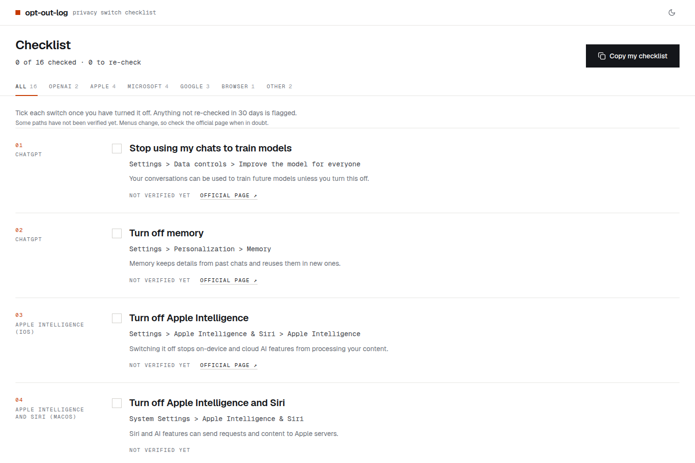
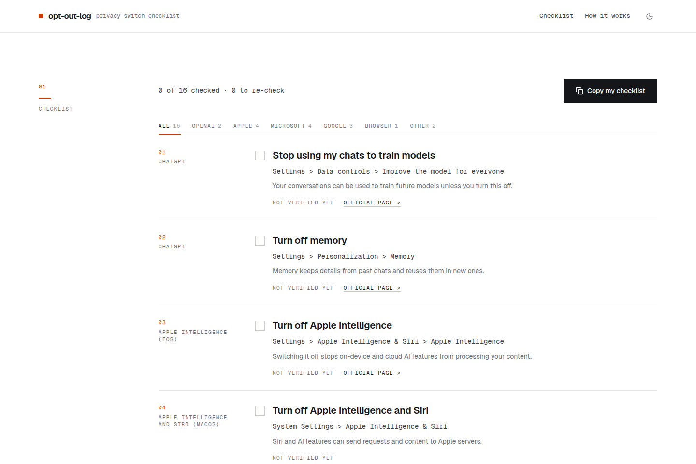
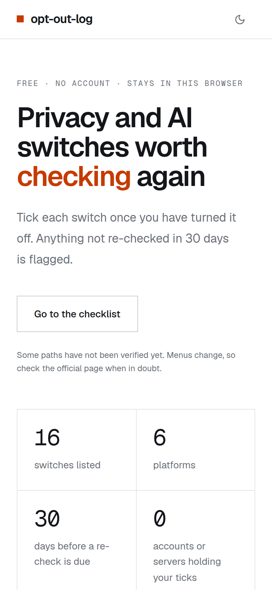

<!--
  The greenlight:live and greenlight:screenshots blocks are written by the Publisher after each deploy (live link,
  screenshots of the live site): keep their markers and leave their contents alone.
-->

# opt-out-log

A checklist of the privacy and AI settings worth turning off, with the menu path to each and a flag when it is time
to check again.

<!-- greenlight:live -->
**[Open opt-out-log → opt-out-log.yangxdev.workers.dev](https://opt-out-log.yangxdev.workers.dev)**
<!-- /greenlight:live -->

<!-- greenlight:screenshots -->




<p align="center">

</p>

<sub>Screenshots of the live site, refreshed on every deploy.</sub>
<!-- /greenlight:screenshots -->

## What it does

- Lists the switches worth turning off in ChatGPT, Gemini, Apple Intelligence, Siri and Apple's analytics, Windows and Recall,
  Microsoft Edge, Outlook on the web, your Google Account, Chrome, Firefox, LinkedIn and GitHub Copilot.
- Gives each one the menu path, one line on why it matters, and a link to the vendor's own page where there is one.
- Remembers when you ticked each switch, in your browser.
- Flags a ticked switch as **Re-check due** after 30 days, because updates and new features can quietly turn settings
  back on.
- Filters by platform, and copies the whole list as Markdown, with your dates.

## How to use it

1. Open the app and pick a platform, or keep **All**.
2. For each switch, follow the path on your device, turn it off, then tick it.
3. Come back after the next round of updates: anything ticked more than 30 days ago shows **Re-check due**.
4. **Copy my checklist** puts the full list on your clipboard as Markdown, to keep or share.

## A note on accuracy

Menus move between versions. Each switch shows **Not verified yet** until someone has followed its path on a real
device; after that it shows the date. When a path doesn't match what you see, use the **Official page** link, and
please tell us (see [Contributing](#contributing)).

## Privacy

Your ticks and their dates stay in this browser (`localStorage`). There is no account, no server storage and nothing
to sync, and the page cannot read your real settings: it only lists them. Page views are counted by Cloudflare Web
Analytics, which sets no cookies.

## Contributing

The whole list is one file, [`src/data/settings.json`](src/data/settings.json). To fix a path, confirm one or add a
switch, edit it in a pull request, or [open an issue](../../issues/new) if you'd rather describe it.

The most useful contribution is a check on a real device: follow a path, and if it matches, set its `verifiedOn` to
that day. Each entry looks like this:

```json
{
  "id": "chatgpt-memory",
  "platform": "openai",
  "product": "ChatGPT",
  "title": "Turn off memory",
  "path": "Settings > Personalization > Memory",
  "why": "Memory keeps details from past chats and reuses them in new ones.",
  "verifiedOn": null,
  "url": "https://help.openai.com/en/articles/8590148-memory-faq"
}
```

| Field | Rule |
|-------|------|
| `id` | unique, lowercase words joined by hyphens |
| `platform` | `openai`, `apple`, `microsoft`, `google`, `browser` or `other` (the filter it appears under) |
| `product`, `title`, `path`, `why` | plain text; `path` uses `>` between menu levels; `why` is one sentence |
| `verifiedOn` | the date you followed the path on a real device (`YYYY-MM-DD`), or `null` |
| `url` | optional; the vendor's own help page, `https://` only |

`npm test` checks every entry against these rules.

## Run it locally

Needs Node.js 22.18 or later.

```bash
npm ci
npm run dev     # the app at http://localhost:5173 (the /api Worker is not running)
npm run check   # lint, tests and a production build
```

`npm run build && npx wrangler dev` serves the built app together with the `/api` Worker.

## Built with

React 19, Vite, Redux Toolkit and Tailwind CSS v4, served by a Cloudflare Worker.

---

Made by [yangxdev](https://github.com/yangxdev). [MIT licensed](LICENSE.md).
